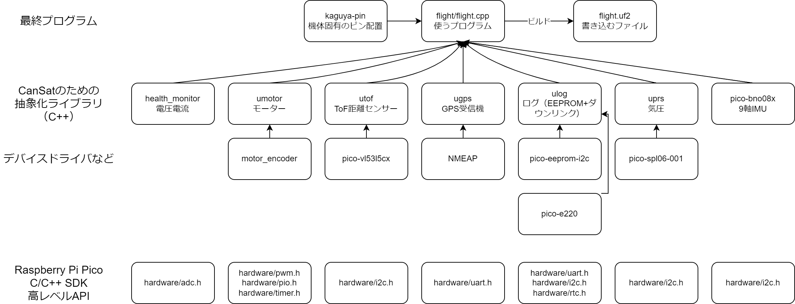

# kaguya-code

第19回能代宇宙イベント出場機体『かぐや』（同志社大学）のコードです。
この機体の特徴は、
- 成功率向上のため、2機体投下
    - タテに二つ重ねて投下するのでなく、制御性向上のため、ヨコに2つ並べてキャリアに収納
    - そのためのタイヤ展開
- 小型の基板
です。

3回投下した中で、投下2回目の7mが最良の結果でした。実際の状況は大会報告書を参照されたいですが、走破性の不足によるスタックが一番の問題でした（3回ともプログラムは正常に動作・ログ取得）。
- 機体：運営特別賞
- ポスター：能代ロケット実験場　所長賞

なお、開発した基板もGitHub上で公開しています。
[リンク](https://github.com/Yudetamago-AM/kaguya-elec)

## このプログラムの構成

図にあるように、数重の抽象化レイヤーがあります。
この図の3段目（デバイスドライバ）までについては、自力で書いたものが多いです。すべてGitHub上で公開してあります。
ただし、NMEAメッセージのパーサーNMEAPはBSDライセンスで公開されているもので、また、pico-bno08xはSparkFunのライブラリをRaspberry Pi Pico C/C++ SDK用に改造したものです。また、pico-vl53l5cxについては、STのULDをほぼそのまま使っています。
